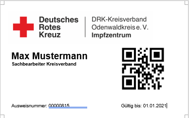

# Zeiterfassung
Eine Lösung zur Zeiterfassung der Helfer im Impfzentrum des Odenwaldkreises.

# Komponenten

Das Projekt besteht aus mehreren Teilanwendungen. Vor Ort gibt es ein Terminal an dem sich jeder Mitarbeiter an- und abmeldet.
Für die Administration haben Schichtleiter, Buchhaltung und Planungsstaab die Möglichkeit auf einer Webanwendung z.B. Mitarbeiter anzulegen oder Tagesreports zu erzeugen.

## Terminalanwendung

Die Terminalanwendung läuft vor Ort auf einem PC, Laptop. Mittels angeschlossenem QR Code Scanner werden die Ausweise der Mitarbeiter beim Betreten und beim Verlassen des Geländes zu Dienstbeginn und Dienstende gescannt. Das erzeugen der QR Codes der Ausweise findet in der Webanwendung statt.




### Getting Started:

Die Terminalanwendung besteht aus mehren Einzelmodulen und kann auch mittels pyinstaller als .exe verpackt werden. 
Hierfür im Ordner Terminal einfach folgenden Befehl nutzen:

```shell
pyinstaller --onefile --windowed main.py
```

Pyinstaller muss dafür installiert sein. 
Wichtig:
Das logo und der Ordner Log müssen händisch mitgenommen werden, d.h. die .exe startet nur, wenn das logo im gleichen Verzeichnis liegt wie die executable und ein Ordner Log existiert.

Die Anwendung kann auch aus der Konsole direkt gestartet werden ohne sie zuvor als executable zu packen. Dafür die requirements installieren via:

```python
pip install -r requirements.txt
```

Gestartet wird die Anwendung über die main.py.
Loglevel kann dort angepasst werden. Die Logs landen im Ordner Log.

### Ablauf


#### Kommen
Der Mitarbeiter scannt seinen Ausweis. Der QR Code wird gelesen es wird geprüft ob es bereits für diesen Tag offene Dienste (Dienstende is NULL) gibt. Wenn nicht, interpretiert das System den Scanvorgang als "KOMMEN".
In der Datenbank wird nun mit der Personalnummer ein Dienstangelegt, die Zeit des Dienstbeginns wird Serverseitig geschrieben. Dienstende bleibt bei diesem Eintrag Null und dienst als Unterscheidungsmerkmal für das Programm der "Richtung". Das der Mitarbeiter seinen Dienst antritt wird ihm mitgeteilt.


#### Gehen
Gibt es bereits Dienste (Dienstende is NULL), interpretiert das System den Scanvorgang als "GEHEN". Der vorhandene Dienst wird geschlossen, die Zeit Dienstende wird gesetzt.
Dem Mitarbeiter wird die Dienstdauer mitgeteilt. Pausen werden hier nicht abgezogen, es handelt sich also um die reine Bruttozeit.


#### Doppelt gescannt
Da der Scanvorgang sehr schnell sein kann, können Doppelbuchungen entstehen. Daher wird jede Buchung überprüft ob es in den letzten 5s bereits eine Buchung gab. D.h. es existiert eine Totzeit von 5s auf der spalte updated. Dies wird dem Mitarbeiter auch angezeigt und die Buchung nicht weiter verarbeitet.


#### Unbekannter Mitarbeiter
Sofern ein QR Code von jmd. gescannt wird der nicht im System angelegt ist, wird die Buchung ebenfalls verworfen. Das der Mitarbeiter unbekannt ist wird ebenfalls angezeigt.
Da die QR Codes beim Anegen in der Webanwendung zufällig erzeugt werden, können QR Codes nur schwer "gefälscht" werden.


#### Code Fehlerhaft
Jeder QR Scan wird ebenfalls auf die korrekte Länge überprüft. Falls irgendein Code an den Scanner gehalten wird, wird die Buchung ebenfalls verworfen.


#### Failover
Da die Datenbank in einem Rechenzentrum laufen kann, wird jede Scanvorgang in eine lokale SQLite Datenbank geschrieben. Dies dient dazu bei Verbindungsproblemen keine Einträge zu verlieren. Im Falle eines Disconnects wird angezeigt, dass der Server zwar gerade nicht erreichbar ist, aber der Buchungsvorgang registriert wurde.
Innerhalb der SQLite werden nur die gescannten Codes und der Zeitpunkt gespeichert. Es gibt hier kein Mapping auf die Personalnummer. Des Weiteren gibt es keinen direkten Eintrag ob es sich um "Kommen" oder "Gehen" handelt.


## MySQL Datenbank

Für die Persistierung wird eine MySQL Datenbank verwendet. Diese kann sowohl von einem Dienstleister in einem Rechenzentrum betrieben werden, als auch lokal auf dem Rechner des Terminals laufen. Je nachdem aus welchen Netzwerken Zugang zur Webapplikation benötigt würde, ist dies dementsprechend zu planen.

Für die Verwendung des Terminals werden zwei Tabellen benötigt. 
Einmal "Personal", welche den zufällig generierten code enthält welcher auch auf der Zugangskarte gedruckt ist, zusammen mit der Personalnummer und dem Namen.
Darüberhinaus einmal "Dienste", in welcher die Dienste mit Beginn und Ende stehen.

Erzeugt werden können die Tabellen mit folgenden SQL statements:

Dienste:
```mysql
CREATE TABLE `Dienste` (
  `id` int(11) NOT NULL,
  `Personalnummer` int(11) NOT NULL,
  `Dienstbegin` timestamp NOT NULL DEFAULT current_timestamp() ON UPDATE current_timestamp(),
  `Dienstende` timestamp NULL DEFAULT NULL,
  `Art` varchar(50) NOT NULL DEFAULT 'Normal',
  `Updated` timestamp NOT NULL DEFAULT current_timestamp(),
  `AutoClosed` tinyint(1) NOT NULL DEFAULT 0
) ENGINE=InnoDB DEFAULT CHARSET=utf8mb4;

ALTER TABLE `Dienste`
  ADD PRIMARY KEY (`id`);

ALTER TABLE `Dienste`
  MODIFY `id` int(11) NOT NULL AUTO_INCREMENT, AUTO_INCREMENT=102;
COMMIT;  
```

Personal:
```mysql
CREATE TABLE `Personal` (
  `id` int(11) NOT NULL,
  `Vorname` varchar(50) NOT NULL,
  `Nachname` varchar(50) NOT NULL,
  `Personalnummer` int(11) NOT NULL,
  `Hash` char(8) NOT NULL,
  `Updated` timestamp NOT NULL DEFAULT current_timestamp()
) ENGINE=InnoDB DEFAULT CHARSET=utf8mb4;

ALTER TABLE `Personal`
  ADD PRIMARY KEY (`id`),
  ADD UNIQUE KEY `Personalnummer` (`Personalnummer`),
  ADD UNIQUE KEY `Hash` (`Hash`);
ALTER TABLE `Personal`
  MODIFY `id` int(11) NOT NULL AUTO_INCREMENT, AUTO_INCREMENT=2;
COMMIT;
```

Für die Möglichkeit zum Planen wurde die Funktionalität erweitert. Hierfür ist eine Planungstabelle notwendig.

Planung:
```mysql

CREATE TABLE `Planung` (
  `id` int(11) NOT NULL,
  `Personalnummer` int(11) NOT NULL,
  `Datum` date NOT NULL,
  `Schicht` int(11) NOT NULL COMMENT '1=Früh;2=Spät;3=Variabel',
  `Comment` varchar(50) NOT NULL,
  `Updated` timestamp NOT NULL DEFAULT current_timestamp()
) ENGINE=InnoDB DEFAULT CHARSET=utf8mb4;


ALTER TABLE `Planung`
  ADD PRIMARY KEY (`id`);

ALTER TABLE `Planung`
  MODIFY `id` int(11) NOT NULL AUTO_INCREMENT, AUTO_INCREMENT=383;
COMMIT;
```


## Webpage

Die Webanwendung dient zu Administration der Mitarbeiter sowie zur Erzeugung von Reports und zum erstellen von Zeiten sowie deren Korrektur.


Für das login sind zwei Tabellen in der Datenbank notwendig. Diese lauten li_user und li_token.
In der li_user werden die Benutzer angelegt. Später kann ggf. eine admin Ansicht dazu kommen.
Mittels Passwort zurücksetzen Funktion kann ein Passwort gesetzt werden.

Nach erfolgreichen Login kann aus den drei Modulen ausgweählt werden. Es gibt einen Autologout, die Zeit wird oben rechts angezeigt.


Zurück zur Hauptseite aus den Modulen gelangt man über den Header "DRK".

### Personaldaten

Die Personaldaten dienen zum Anlegen und Einsehen von Mitarbeitern.
Prinzipielle gibt es hier zwei Funktionen. Einmal das Anlegen von Mitarbeitern und einmal das Auswählen.


Das Anlegen geschieht über das Eintragen von Personalnummer, Vorname und Nachname. Bei der Anlage wird ein Datenbankeintrag erzeugt. Dies beinhaltet den zufällig erzeugten QR Code.

Auswahl der Person geschieht über Suchen mittels Personalnummer oder Namen. Hier werden der QR Code angezeigt und es gibt die Möglichkeit des erstellens von Reports.


### Zeitkorrektur

Beim Buchen der Zeiten kann es zu Fehlern kommen. Daher gibt es im Modul der Zeitkorrektur die Möglichkeit Zeiten zu bearbeiten. Ebenfalls existiert hier die Möglichkeit Zeiten wie z.B. Urlaub oder Krankheitstage hier einzutragen.

Für die Verwendung wird der Mitarbeiter und der Tag ausgewählt. Die geleisteten Dienste werden aufgeführt und können korrigiert werden. Neue Dienste können hier ebenfalls hinzugefügt werden.


### Tagesreports

Der Tagesreport m Modul Reports dient dazu, die Dienste des Vortages aufzulisten. Dies kann z.b. per Cron dem Schichtleiter zugesendet werden. Das Layout als Beispiel sieht wie folgt aus:


Nachts werden via Konfiguration in phpmyadmin alle offenen Dienste automatisch geschlossen. Dies wird in der Spalte "AutoClose" auch markiert, so dass im Report die Zeiteinträge die vermutlich fehlerhaft sind farblich markiert werden.

Der nächtliche Autoclose wird konfiguriert mit:

```mysql
CREATE EVENT `Nightly AutoClose` ON SCHEDULE EVERY 23 DAY STARTS '2021-01-01 14:49:49' ENDS '2021-12-31 14:49:49' ON COMPLETION NOT PRESERVE ENABLE DO Update Dienste SET Dienstende = current_timestamp(), AutoClosed = '1' WHERE Dienstende is NULL
```

Das setzten der pdf kann unter TagesreportPDF/pdfcreator/pdf.py angepasst werden. Ausführen der job.pdf ohne Argumente erzeugt einen Tagesreport des vergangenen Tages. 

```python 
python job.py
```

Beim Übergaben eines Datums mittels 'YYYY-MM-DD wird der Tagesreport für den übergebenen Tag erzeugt.

```python 
python job.py '2021-01-11'
```

Die Reports liegen im Ordner Reports im Überverzeichnis. D.h. der Ordner muss ggf. erste händisch angelegt werden. Gleiches gilt für den Ordner Logs.

Aus der Webapplikation kann dieser Report ebenfalls erzeugt werden. Hierfür den Tag wählen und auf PDF-Report klicken. Der Report wird zum Download angeboten.


### Einzelabrechnungen
Einzelabrechnugnen werden verwendet um pro Mitarbeiter eine Ansicht der geleisteten Dienste zu erzeugen.

Das setzten der pdf kann unter EinzelabrechnungpDF/pdfcreator/pdf.py angepasst werden. Ausführen der job.pdf kann in zwei Varianten erfolgen: 

```python 
python job.py MONAT JAHR ANFORDERER PERSONALNUMMER
```
Hierbei steht Monat und Jahr für den Monat/Jahr der Einzelnachweisanforderung. Der Anforderer als ID ist die ID des in der Webapplikation angelegten Users. Diese wird beim übergeben eines 4 Arguments, der Personalnummer, nicht verwendet.

Beim weglassen einer Personalnummer werden die Einzelnachweise von allen vorhandenen Mitarbeitern erzeugt und als Zip gepackt. Die ID des Anforders dient dazu, die Mailadresse aus der Datenbank in li_user rauszulesen und den Download link per Mail zu verschicken.

```python
python job.py MONAT JAHR ANFORDERER
```

Die Reports/Zip´s liegen im Ordner Reports im Überverzeichnis. D.h. der Ordner muss ggf. erste händisch angelegt werden. Gleiches gilt für den Ordner Logs.
Das versenden der Mail erfolgt über Zugangsdaten die in der config.ini angepasst werden müssen.


Aus der Webapplikation kann dieser Report erzeugt werden. Hierfür den User im Modul Personaldaten raussuchen, Monat und Jahr wählen und PDF-Report klicken. Der Report wird zum Download angeboten.


Im Falle zum Nachweisen aller Mitarbeiter ist dies unter dem Modul Reports zu finden. Hier kann ein Monatsreport für alle Mitarbeiter erstellt werden. Dabei werden die Einzelnachweise in ein Zip gepackt. Das Zip wird nicht direkt zum Download angeboten, je nach Anzahl der Mitarbeiter kann der Erstellungsvorgang mehrere Minuten dauern.
Der Downloadlink wird per Mail an den Anforderer versendet.


### CSVExports
Der CSV Export dient zur Übersicht aller geleisteten Stunden der Mitarbeiter und der Ausgabe in dem für das Abrechnugssystem erwarteten Formats.
Das Format der CSV kann unter CSVExport/createCSV.py angepasst werden und ist Abrechnungsspezifisch. Der Output liegt ebenfalls im Ordner Reports.

Angestoßen wird die Erzeugung via der job.py mit der Übergabe von MONTA und Jahr als Argumente.

```python
python job.py MONAT JAHR
```

Aus der Webapplikation kann diese CSV ebenfalls erzeugt werden. Hierfür den Monat und das Jahr auswählen und auf CSV-Report klicken. Der Report wird zum Download angeboten.


## Kurzanleitung zum Betrieb der Webapp + Datenbankserver

Um die Webanwendung den Nutzern zugänglich zu machen wird ein Server benötigt. Dieser kann sowohl im lokalen Netztwerk als auch in der Cloud betrieben werden. Wir empfehlen zum Betrieb des Webservers den klassichen LAMP Stack. Konfigurationen mit nginx sind auch problemlos möglich. Als Datenbank muss eine zu MySQL kompatible Datenbank gewählt werden. An dieser Stelle geben wir keine detailierte Anleitung zum einrichten eines LAMP Stacks, da sich breits zahlreiche Anleitungen im Internet finden lassen. Es folgt jedoch eine Auflistung von Schritten, die für einen sicheren, datenschutzkompatiblen Betrieb notwendig sind (nicht unbedingt hinreichend und OHNE GEWÄHR!):
* Einrichtung einer Firewall mit Freigaben für die Ports: 22, 80, 443 und 3306
* Installation eines SSL/TSL Zertifikats, z.B. von Let's Encrypt
* Erzwingen von SSL/TSL Verschlüsselung für die Kommunikation mit der Website
* Anlegen von MySQL/MariaDB Datenbanken
* Anlegen von Datenbankuser für die webapp, z.B.: webservice@localhost, Authentifizierung Passwort oder Socket
* Anlegen von Datenbankuser für die terminal Anwendung, z.B. terminal@%, WICHTIG: Erzwigen von SSL/TSL Verschlüsselung, 
Authentifizierung Passwort
* Aktivierung von Serverseitiger SSL/TSL Verschlüsselung für den Datenbankserver + Installation von SSL/TSL Zertifikat

Beachte: Diese Schritte sind nur gültig falls sich Datenbank und Webapp auf dem selben Server befinden. Im Prinzip ist dies nicht notwenig, aber vereinfacht die sichere Kommunikation zwischen Webapp und Datenbank erheblich.